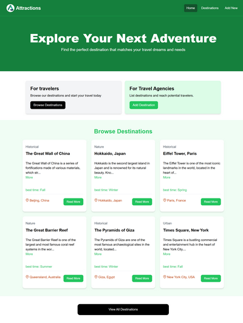
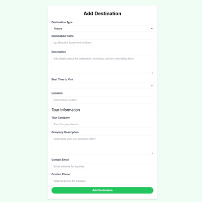
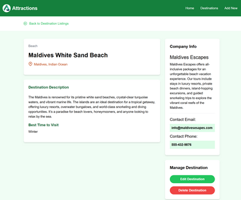
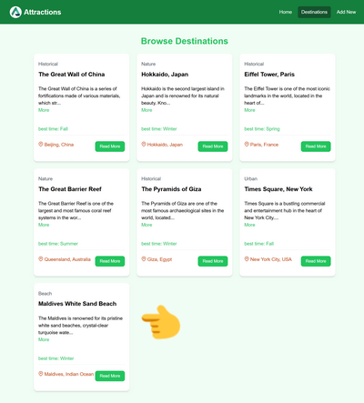

# Attractions

## 目錄

- [Attractions](#attractions)
  - [目錄](#目錄)
  - [簡介](#簡介)
  - [功能介紹](#功能介紹)
    - [首頁](#首頁)
    - [新增文章](#新增文章)
    - [編輯文章](#編輯文章)
    - [刪除文章](#刪除文章)
  - [安裝與啟動](#安裝與啟動)
    - [Clone](#clone)
    - [Project Setup](#project-setup)
    - [Compile and Hot-Reload for Development](#compile-and-hot-reload-for-development)
    - [Compile and Minify for Production](#compile-and-minify-for-production)
  - [Recommended IDE Setup](#recommended-ide-setup)
  - [Customize configuration](#customize-configuration)


## 簡介

👋 大家好，我叫 Air ，這是我做的留言板📝，歡迎訪客任意新增🆕與編輯✏️文章，  <br/>
（可以刪除文章，但前六筆僅開放編輯，無法刪除，他們做為網站 Demo ，故保留前六筆）    <br/>


廢話不多說， 前往連結👉[Attractions](https://attractions-alfa.netlify.app/)     <br/>

前端使用`Vue`框架搭建，後端使用`Express`，      <br/>
目前都是景點的介紹文，但也歡迎各位留下你想要的訊息✍️，內容不限，主題自由🎨，        <br/>
我會每隔一段時間重置後端資料，所以想寫什麼就寫什麼吧🆓     <br/>

<br/>

## 功能介紹

### 首頁
  <br/>

在歡迎文字(Hero)的下方，有左右各一張 Card，     <br/>
- 點擊左方的 `Browse Destinations` 按鈕可以瀏覽每篇文章📖，       <br/>
- 右方的 `Add Destination` 按鈕則可以新增文章✍️。     <br/>

接著往下一點，來到`Browse Destinations`區塊，列出了一部分文章(六筆)， <br/>
在個別文章點擊 More 可以展開文章敘述。  <br/>

想看所有文章📚，請點擊下方黑色的 `View All Destinations` 按鈕，     <br/>
或者最右上方的 `Destinations` 按鈕。 <br/>
<br/>


### 新增文章

如果您只是來玩玩，那以下的說明當成參考就好囉~😄 <br/>
若想新增文章，點擊`Add Destination`後，會看到一張給旅遊公司填寫的表單📋，如下圖:  <br/>

 <br/>

- Destination Type  : 景點的類型，有自然風光、歷史景點、城市、海灘 可以選
- Destination Name  : 景點名稱
- Description       : 關於這個景點的描述
- Best Time to Visit : 最佳前往季節，有春、夏、秋、冬可以選
- Location          : 該景點的位置在哪裡
- Tour Company      : 旅遊公司/旅行社 的名稱
- Company Description : 關於旅遊公司的描述
- Contact Email     : 旅遊公司的 Email
- Contact Phone     : 旅遊公司的 連絡電話

填寫完畢後，按下下方的`Add Destination`按鈕送出就可以了。   <br/>
看到文章獨立畫面，即代表文章新增成功 👇   <br/>


點擊上方的`Back to Destination Listings`連結，回到文章列表，    <br/>
可以在列表末尾看到自己剛剛新增的文章 👇



<br/>


### 編輯文章

1. 在文章列表點擊`Read More`按鈕，進入文章獨立頁面
2. 點擊右下方的`Edit Destination`即可進入編輯畫面，和新增文章的步驟是一樣的， <br/>
修改完畢後，按下送出即可。
<br/>
<br/>

### 刪除文章

1. 在文章列表點擊`Read More`按鈕，進入文章獨立頁面
2. 點擊右下方的`Delete Destination`，會跳出提示，點擊確認即可刪除
3. 如果沒有刪除成功，可能是選到前六筆的文章了
4. 若還是很想刪文章，就找第七筆以後的文章吧，或者自行新增文章也可以

<br/>


## 安裝與啟動

### Clone

```sh
git clone git@github.com:clazenchang/attraction.git
```

### Project Setup

```sh
cd attraction
npm install
```

### Compile and Hot-Reload for Development

```sh
npm run dev
```


### Compile and Minify for Production

```sh
npm run build
```

## Recommended IDE Setup

[VSCode](https://code.visualstudio.com/) + [Volar](https://marketplace.visualstudio.com/items?itemName=Vue.volar) (and disable Vetur).


## Customize configuration

See [Vite Configuration Reference](https://vitejs.dev/config/).